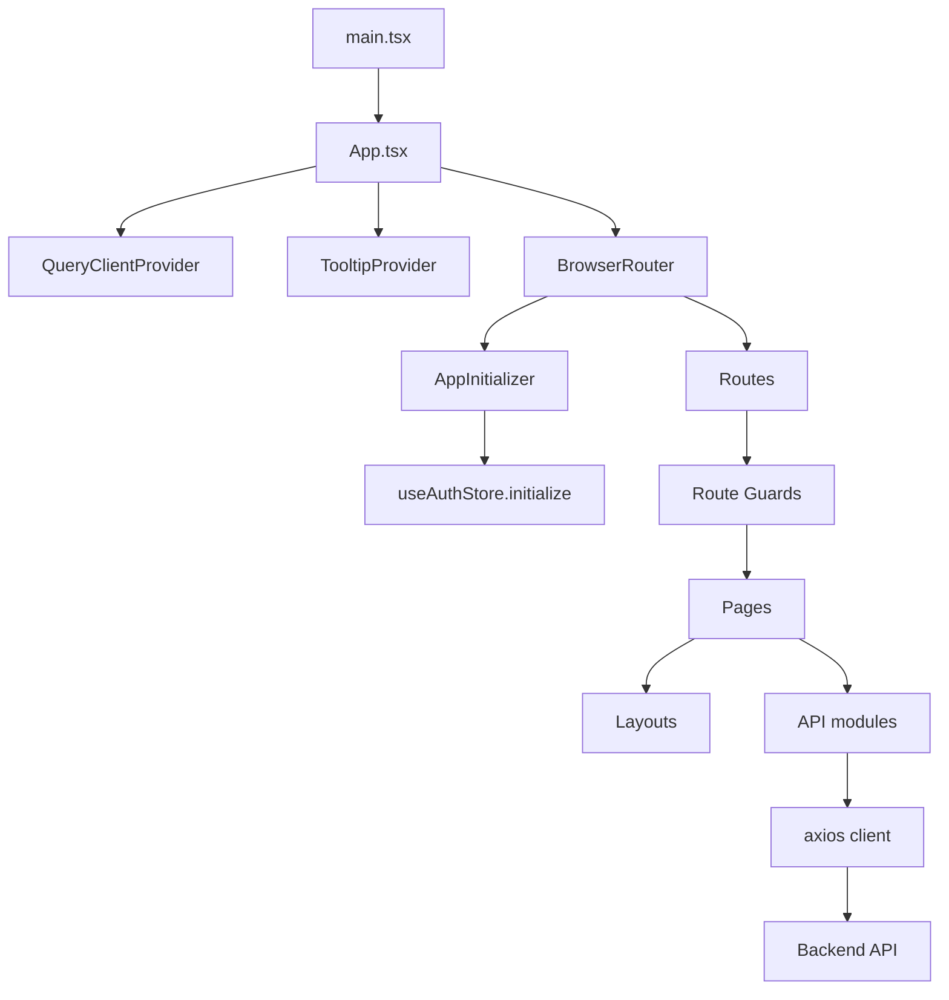

# Arquitectura Frontend

## Stack principal

- React 18 + Vite
- TypeScript
- React Router v6
- Zustand para autenticacion y estado UI pequeno
- React Query para algunos flujos admin
- Axios para integracion HTTP
- Tailwind CSS + shadcn/ui + Radix UI
- Sonner para notificaciones
- Lightweight Charts y Recharts para graficas

## Punto de entrada

- `src/main.tsx` monta la aplicacion.
- `src/App.tsx` compone providers, inicializacion de sesion y mapa de rutas.

## Diagrama general



## Estructura de carpetas

```text
src/
  api/           Clientes por dominio
  components/    UI compartida y navegacion
  hooks/         Hooks reutilizables
  layouts/       Layouts de alto nivel
  lib/           Utilidades de dominio e infraestructura
  pages/         Pantallas finales por modulo o rol
  routes/        Guards y reglas de navegacion
  store/         Estado global ligero
  test/          Setup de pruebas
```

## Capas del sistema

### 1. Routing y acceso

La navegacion vive en `src/App.tsx` y se apoya en guards de `src/routes/guards.tsx`.

Responsabilidad:

- decidir que pagina se monta
- impedir acceso por falta de token
- impedir acceso por rol incorrecto
- redirigir segun estado de cuenta o perfil

### 2. Estado global

El frontend evita un store global grande. Hoy el estado global real esta concentrado en:

- `src/store/auth.ts`
- `src/store/admin-ui.ts`

La mayor parte del estado de pantallas es local a cada pagina.

### 3. Integracion HTTP

La base esta en `src/api/axios.ts`.

Encima de ese cliente se organizan modulos:

- `src/api/auth.ts`
- `src/api/users.ts`
- `src/api/academic.ts`
- `src/api/groups.ts`
- `src/api/evaluations.ts`
- `src/api/analytics.ts`
- `src/api/students.ts`

### 4. Presentacion

Las pantallas finales estan en `src/pages/*`.

Patron dominante:

- la pagina obtiene datos
- normaliza payloads del backend
- muestra estados de carga, vacio y error
- usa `DashboardLayout` si la vista es privada

### 5. UI base

La libreria visual base esta en `src/components/ui/*`.

Importante:

- estas piezas no representan negocio
- envuelven componentes Radix y estilos Tailwind
- las paginas no deberian reimplementar botones, tablas o selects base si ya existe un wrapper

## Rutas por rol

### Publicas

- `/`
- `/login`
- `/register`
- `/complete-profile`
- `/account-status`

### Compartidas autenticadas

- `/dashboard`
- `/profile`

### Admin

- `/users`
- `/users/pending`
- `/academic/school-years`
- `/academic/periods`
- `/academic/grades`
- `/academic/areas`
- `/academic/aulas`
- `/academic/promotions`
- `/groups`
- `/groups/:id`
- `/groups/enrollments`
- `/evaluations/stats`
- `/evaluations/stats/:school_year_id`

### Teacher

- `/my-groups`
- `/groups/:id/grade-items`
- `/groups/:id/scores`
- `/period-results`

### Student

- `/my-grades`
- `/my-results`

## Layout principal

`src/layouts/DashboardLayout.tsx` define:

- sidebar contextual por rol
- header con avatar y acciones de usuario
- contenedor principal de contenido

La navegacion lateral se define en `src/components/AppSidebar.tsx`.

## Principios actuales del proyecto

- El frontend esta organizado por dominios de negocio, no por tipo tecnico puro.
- El estado de sesion es global; el estado de pantalla es local salvo casos especificos.
- La capa API intenta encapsular endpoints, pero varias paginas aun normalizan payloads manualmente.
- Algunas vistas todavia mezclan logica de integracion y presentacion en el mismo archivo. Eso debe asumirse al mantenerlas.

## Riesgos tecnicos actuales

- Hay mezcla entre vistas totalmente conectadas a backend real y vistas con restos de datos mockeados.
- El shape del backend no siempre es consistente entre modulos, por eso aparecen helpers como `unwrap`, `asArray` o `getPayload`.
- Varias entidades tienen multiples IDs validos en el sistema (`User`, `Student`, `Teacher`), lo que obliga a documentar muy bien el contrato esperado por cada endpoint.
